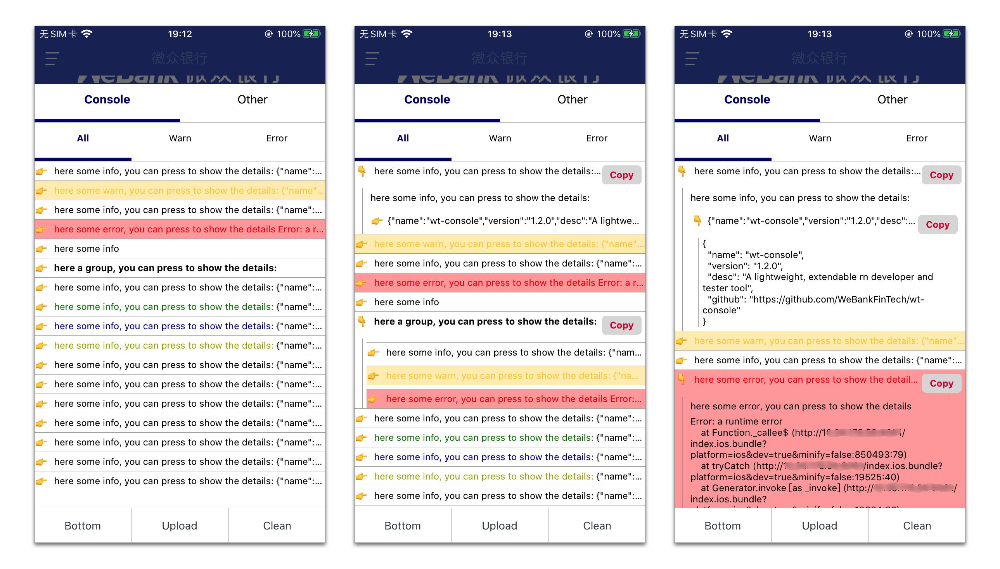
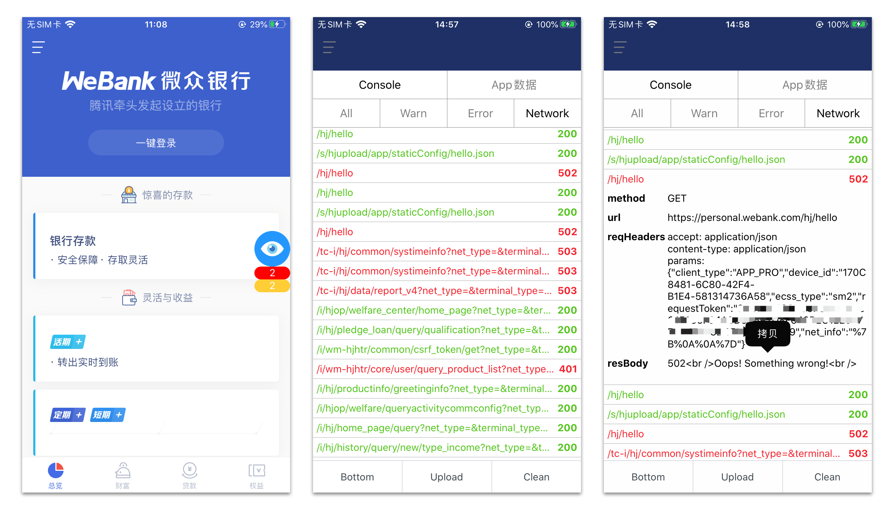

# wt-console

[](https://shields.io/)
[](https://standardjs.com)


注：从[WeTrident项目](https://gitee.com/WeBank/WeTrident)提炼而来。

## 📥 安装

- `npm i @webank/wt-console --save`
- `yarn add @webank/wt-console`

## 💡 背景

App开发过程中，经常会遇到一个场景就是，测试说我遇到一个xxx问题，但是不能复现，之前比较多的解决方案是基于文件日志。我们自己使用过程中发现文件日志太重，而且测试同学取日志的学习成本太高。于是在web项目中开始使用类似vConsole这一类的工具，又因为我们主要使用到的日志查看和日志上传功能。因此我们在React Native实现了类似vConsole的功能，同时在陆续扩展一些功能。

## 🌱 特性

1. 添加一行代码即可在App内查看日志。
2. 支持展示Network信息（目前支持fetch api的展示）。
3. 收拢警告和错误提示，跟RN内烦人的底部黄色警告条说再见。

## 📱 截图





## 📗 用法说明

正式使用之前可以先使用snack版本体验，在线示例： [https://snack.expo.io/@erichua23/live-demo](https://snack.expo.io/@erichua23/live-demo)

### 基础用法
将`TianYan`嵌入到App最外层View中：

``` jsx
import TianYan from '@webank/wt-console'

export default class SimpleApp extends Component {
  render () {
    return (
      <View style={styles.container}>
        {/* other view */}
        
        {/* 添加下面一行代码即完成接入 */}
        <TianYan />
        
      </View>
    )
  }
}
```

### 进阶用法
这部分主要介绍两个属性：`ignoreRedBox`和`ignoreYellowBox`，RN对警告的处理比较暴力，直接使用浮窗在底部拦截操作，遇到警告比较多的时候非常烦人。官方提供的了ignore的方式，但是用官方的ignore，又担心某些需要关心的警告被忽略。
wt-console采用了折中的策略，将黄色警告条去除后都收拢到wt-console的图标上展示，出现warning的时候开发者可以自有选择当前是否需要继续查看warning的详细信息。如下代码将错误和警告都收拢到wt-console统一管理。
``` jsx
<TianYan
  options={{
    ignoreRedBox: true,
    ignoreYellowBox: true
  }}
/>
```


## ❤️ 我们的其他项目

- [WeTrident](https://github.com/WeBankFinTech/WeTrident): 一站式App开发套件。
- [React Native Search List](https://github.com/UnPourTous/react-native-search-list): A searchable ListView which supports Chinese PinYin and alphabetical index.
- [React Native Popup Stub](https://github.com/UnPourTous/react-native-popup-stub): A smart popup container.
- [WT Console Server](https://github.com/UnPourTous/wt-console-server): An open source log manager backend.

## 🤝 类似项目

- [web-console](https://github.com/whinc/web-console)：H5-based mobile web debugging tool similar to chrome devtools.
- [vConsole](https://github.com/Tencent/vConsole)：A lightweight, extendable front-end developer tool for mobile web page.


