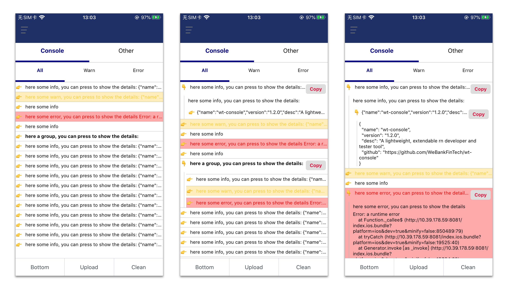

# wt-console - React Native应用内日志工具

[](https://shields.io/)
[](https://standardjs.com)


注：从[WeTrident项目](https://gitee.com/WeBank/WeTrident)提炼而来。

## 安装

- `npm i @webank/wt-console`
- `yarn add @webank/wt-console`

## 💡 背景

App开发过程中，经常会遇到一个场景就是，测试说我遇到一个xxx问题，但是不能复现，之前比较多的解决方案是基于文件日志。我们自己使用过程中发现文件日志太重，而且测试同学取日志的学习成本太高。于是在web项目中开始使用类似vConsole这一类的工具，又因为我们主要使用到的日志查看和日志上传功能。因此我们在React Native实现了类似vConsole的功能，同时在陆续扩展一些功能。

## 🌱 特性

1. 通过简单的接入即可在App内查看日志，提供优美的日志格式展示。
2. 结合 [wt-console-server](https://gitee.com/UnPourTous/wt-console-server) 可以很方便的实现日志上传功能。

## 📱 截图



## 📗 基本用法

将`TianYan`嵌入到App最外层View中：

``` jsx
export default class SimpleApp extends Component {
  render () {
    return (
      <View style={styles.container}>
        {/* other view */}
        <TianYan />
      </View>
    )
  }
}
```

## ❤️ 我们的其他项目

- [WeTrident](https://github.com/WeBankFinTech/WeTrident): 一站式App开发套件。
- [React Native Search List](https://github.com/UnPourTous/react-native-search-list): A searchable ListView which supports Chinese PinYin and alphabetical index.
- [React Native Popup Stub](https://github.com/UnPourTous/react-native-popup-stub): A smart popup container.
- [WT Console Server](https://github.com/UnPourTous/wt-console-server): An open source log manager backend.

## 类似项目

- [web-console](https://github.com/whinc/web-console)：H5-based mobile web debugging tool similar to chrome devtools.
- [vConsole](https://github.com/Tencent/vConsole)：A lightweight, extendable front-end developer tool for mobile web page.


